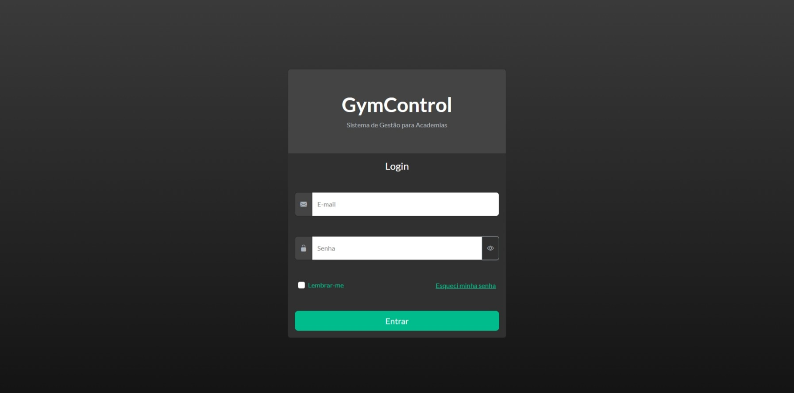
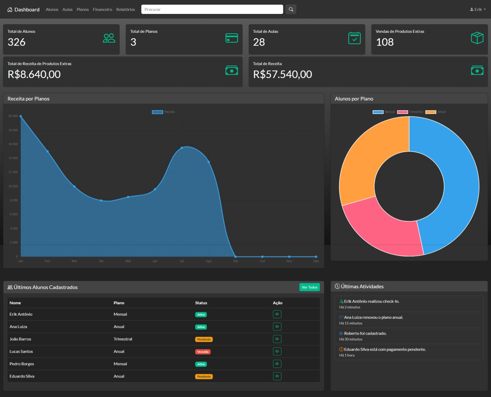

# 🏋️ GymControl

GymControl é um sistema administrativo fictício para academias, desenvolvido com foco na criação de interfaces modernas e responsivas.

O projeto foi desenvolvido para praticar e demonstrar conhecimentos em **Bootstrap 5, HTML5, CSS3, JavaScript e Chart.js**, aplicando componentes, layouts e interações presentes em sistemas administrativos reais.

---

## 📸 Preview

<p align="center">
  
  
</p>

---

## 🚀 Tecnologias Utilizadas

- HTML5
- CSS3
- Bootstrap 5
- JavaScript
- Chart.js
- Bootstrap Icons

---

## ✨ Funcionalidades

- Tela de Login
- Loader de carregamento
- Validação de formulário
- Mostrar/Ocultar senha
- Dashboard responsivo
- Cards com indicadores
- Gráfico de receita mensal
- Gráfico de alunos por plano
- Tabela de últimos alunos cadastrados
- Lista de últimas atividades
- Navegação com scroll suave entre as seções
- Destaque visual ao navegar pelas seções do Dashboard

---

## 📁 Estrutura do Projeto

```
GymControl/
│
├── index.html
├── dashboard.html
├── README.md
│
└── assets/
    │
    ├── bootstrap/
    │   └── bootstrap.min.css
    │
    ├── css/
    │   ├── login.css
    │   └── dashboard.css
    │
    ├── js/
    │   ├── login.js
    │   └── dashboard.js
    │
    ├── icons/
    │   ├── dashboard.png
    │   └── gym.png
    │
    └── images/
        ├── dashboard.jpeg
        └── login.jpeg
```

---

## 🎯 Objetivo

Este projeto foi desenvolvido com o objetivo de consolidar conhecimentos em desenvolvimento Front-end utilizando Bootstrap 5, criando uma interface administrativa moderna, organizada e responsiva.

Durante o desenvolvimento foram utilizados diversos componentes do Bootstrap, além de JavaScript para adicionar interatividade à aplicação e Chart.js para exibição de gráficos.

---

## 👨‍💻 Autor

**Erik Antônio Rodrigues Pires**